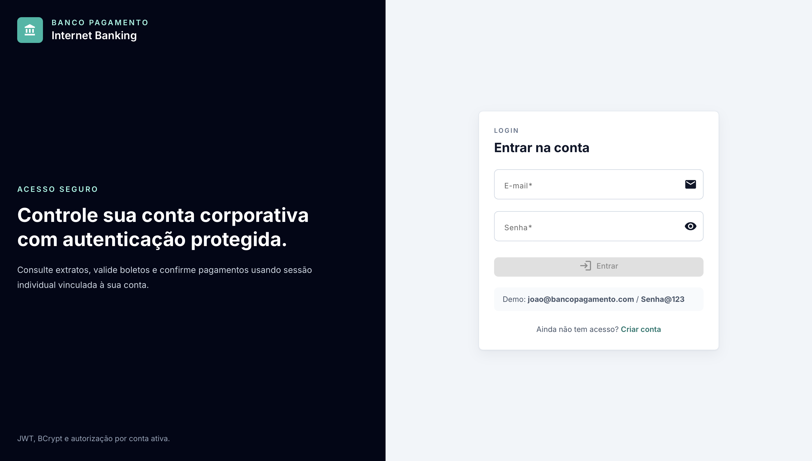
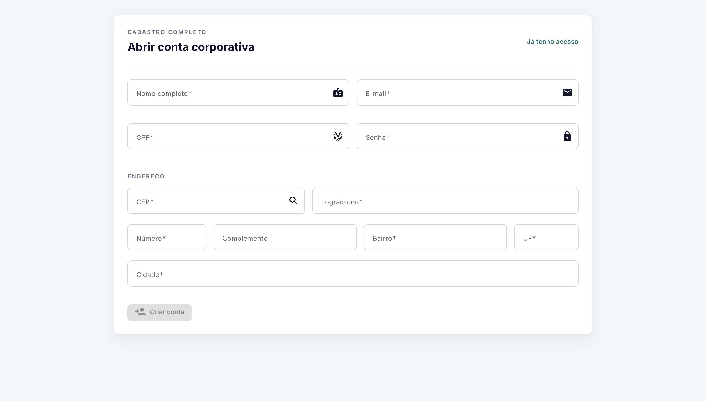
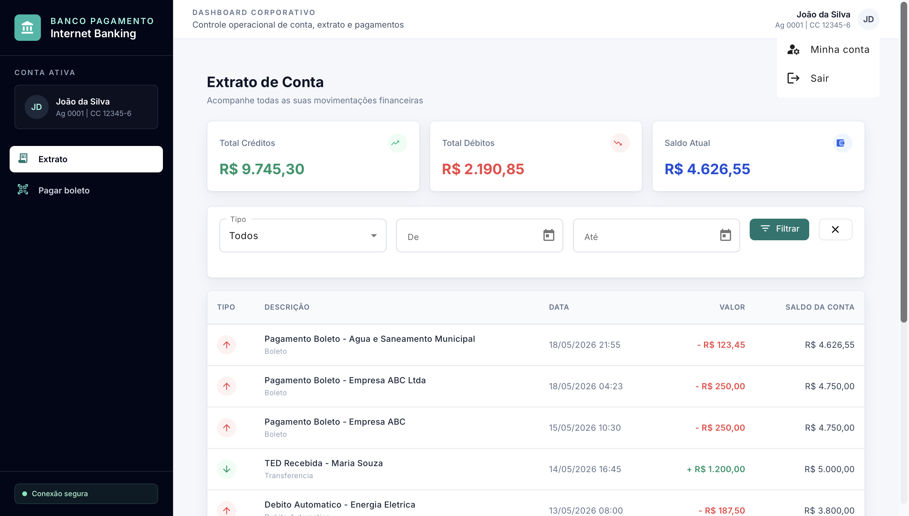
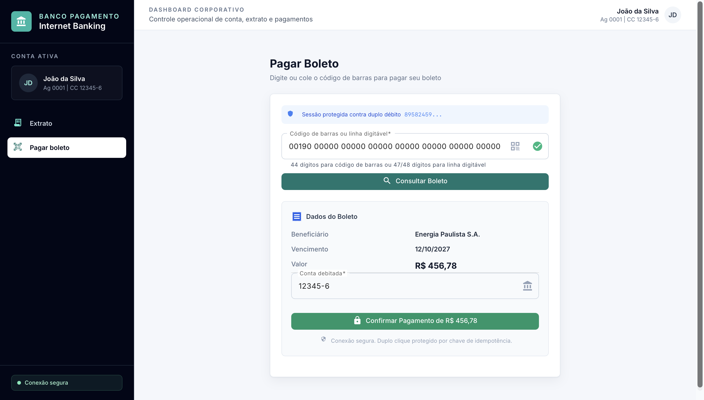
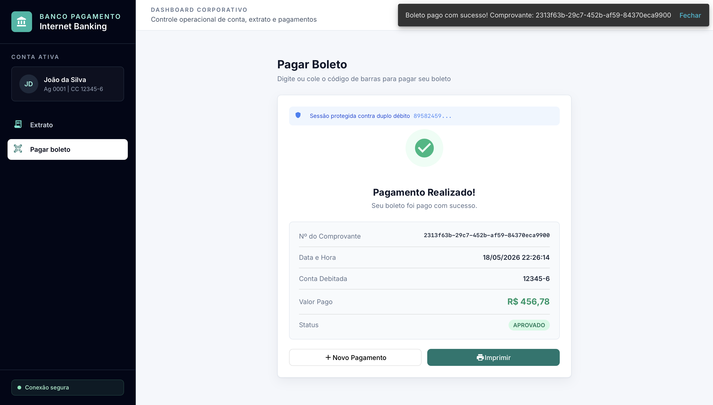
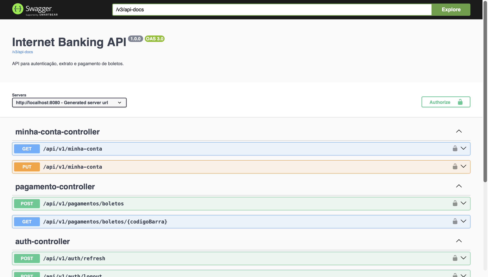

# Internet Banking Corporativo

Aplicação full stack de internet banking corporativo para cadastro de usuários, autenticação, consulta de extrato, consulta/pagamento de boletos, gestão de dados da conta e auditoria de eventos sensíveis.

O projeto foi organizado como um monorepo com duas aplicações principais:

- `apps/payment-service`: API backend em Java/Spring Boot.
- `apps/internet-banking`: aplicação web em Angular.

---

## Sumário

- [Demonstração](#demonstração)
- [Funcionalidades](#funcionalidades)
- [Arquitetura](#arquitetura)
- [Arquitetura do Frontend](#arquitetura-do-frontend)
- [Tecnologias Utilizadas](#tecnologias-utilizadas)
- [Fluxo Principal da Aplicação](#fluxo-principal-da-aplicação)
- [Estrutura do Repositório](#estrutura-do-repositório)
- [Como Rodar com Docker](#como-rodar-com-docker)
- [Credenciais de Demonstração](#credenciais-de-demonstração)
- [Configuração de Ambiente](#configuração-de-ambiente)
- [Banco de Dados](#banco-de-dados)
- [Endpoints Principais](#endpoints-principais)
- [Swagger](#swagger)
- [Rodar Backend Localmente](#rodar-backend-localmente)
- [Rodar Frontend Localmente](#rodar-frontend-localmente)
- [Testes](#testes)
- [CI no GitHub Actions](#ci-no-github-actions)
- [Segurança](#segurança)
- [Observabilidade](#observabilidade)
- [Decisões Técnicas](#decisões-técnicas)
- [Melhorias Futuras](#melhorias-futuras)
- [Licença](#licença)

---

## Demonstração

### Login



### Cadastro de Usuário



### Extrato de Conta



### Pagamento de Boleto



### Confirmação de Pagamento



### Documentação da API (Swagger)



---

## Funcionalidades

### Autenticação e Cadastro

- Cadastro completo de usuário.
- Captura de endereço durante o cadastro.
- Busca de endereço por CEP no frontend.
- Login com credenciais.
- Sessão autenticada com cookies.
- Refresh de sessão.
- Logout.
- Proteção de rotas no frontend.
- Proteção de endpoints no backend.
- Rate limit no login para reduzir tentativas abusivas.

### Conta

- Exibição de dados da conta ativa.
- Exibição de agência, número da conta, CPF, endereço e saldo.
- Tela **Minha conta** para consulta e edição de dados cadastrais.
- Acesso à opção **Minha conta** pelo menu do usuário no avatar do header.

### Extrato

- Consulta de movimentações da conta autenticada.
- Filtro por tipo de transação.
- Filtro por período.
- Paginação da listagem.
- Cálculo de totais de créditos, débitos e saldo atual.

### Boletos

- Consulta de boleto por código de barras ou linha digitável.
- Validação de formato do boleto no frontend.
- Pagamento de boleto.
- Controle de idempotência para evitar pagamento duplicado.
- Registro de transação após pagamento.

### Auditoria

O backend registra eventos relevantes em banco de dados:

- Login bem-sucedido.
- Falha de login.
- Bloqueio por rate limit.
- Criação de conta.
- Pagamento de boleto.
- Atualização cadastral.

Esses registros são importantes em sistemas bancários porque criam rastreabilidade operacional e facilitam análise de incidentes.

### Resiliência e Mensageria

- Integração com Kafka para eventos de pagamento.
- Padrão Outbox para publicação confiável de eventos.
- Resilience4j com circuit breaker e retry para chamadas externas.
- Actuator para health check e métricas.

---

## Arquitetura

O backend segue uma abordagem inspirada em **Clean Architecture** e **Arquitetura Hexagonal**. A regra principal é manter o domínio e os casos de uso independentes de frameworks, banco de dados, HTTP e serviços externos.

### Backend

Estrutura principal:

```text
apps/payment-service/src/main/java/com/banco/pagamento
├── application
│   ├── domain
│   └── usecase
├── ports
│   ├── inbound
│   └── outbound
└── adapters
    ├── inbound
    ├── outbound
    ├── config
    └── security
```

### Camadas do Backend

#### `application/domain`

Contém as entidades e conceitos centrais do negócio, como conta, boleto, transação, usuário e auditoria.

Essa camada não deve depender de Spring, JPA, REST ou banco de dados.

#### `application/usecase`

Contém os casos de uso da aplicação, como:

- autenticar usuário;
- cadastrar usuário;
- consultar extrato;
- consultar boleto;
- processar pagamento;
- consultar e atualizar minha conta.

Os casos de uso coordenam regras de negócio e dependem de portas, não de implementações concretas.

#### `ports/inbound`

Contratos de entrada da aplicação. Representam o que o sistema oferece para o mundo externo.

Exemplos:

- `ConsultarBoletoPort`
- `ProcessarPagamentoPort`
- `ConsultarExtratoPort`
- `ConsultarMinhaContaPort`
- `AtualizarMinhaContaPort`

#### `ports/outbound`

Contratos de saída. Representam dependências externas necessárias para executar os casos de uso.

Exemplos:

- repositórios;
- gateway externo;
- publicador de eventos;
- auditoria.

#### `adapters/inbound`

Adaptadores de entrada. Hoje o principal adaptador é REST, com controllers Spring MVC.

Exemplos:

- `AuthController`
- `ExtratoController`
- `PagamentoController`
- `MinhaContaController`

#### `adapters/outbound`

Adaptadores de saída. Implementam persistência, mensageria e integração externa.

Exemplos:

- repositories JPA;
- entidades JPA;
- adapters de persistência;
- producer Kafka;
- gateway simulado de banco central.

#### `adapters/security`

Configurações e serviços de segurança:

- JWT;
- cookies;
- filtros;
- autenticação;
- rate limit;
- auditoria.

---

## Arquitetura do Frontend

O frontend também foi separado por responsabilidades, aproximando a organização de uma arquitetura limpa no Angular.

Estrutura principal:

```text
apps/internet-banking/src/app
├── core
├── data
├── domain
├── presentation
└── store
```

### Camadas do Frontend

#### `core`

Serviços e recursos transversais:

- guards;
- interceptors;
- handlers globais de erro;
- serviços de autenticação;
- serviço de CEP;
- configuração de internacionalização do Angular Material.

#### `domain`

Modelos e validadores usados pela aplicação.

Exemplos:

- modelos de autenticação;
- modelos de boleto;
- modelos de extrato;
- validador de boleto.

#### `data`

Repositórios responsáveis por comunicação com a API.

Exemplos:

- `extrato.repository.ts`
- `pagamento.repository.ts`

#### `presentation`

Componentes visuais e telas:

- login;
- cadastro;
- layout autenticado;
- extrato;
- pagamento;
- minha conta.

#### `store`

Gerenciamento de estado com NgRx para fluxos como extrato e pagamento.

---

## Tecnologias Utilizadas

### Backend

- Java 21
- Spring Boot 3.3
- Spring Web
- Spring Security
- Spring Data JPA
- Bean Validation
- JWT com `jjwt`
- MySQL 8
- Flyway
- Kafka
- Spring Kafka
- Resilience4j
- MapStruct
- Lombok
- Springdoc OpenAPI/Swagger
- Actuator
- JUnit 5
- Mockito
- Maven

### Frontend

- Angular 18
- Angular Material
- Angular Router
- Reactive Forms
- NgRx Store
- NgRx Effects
- RxJS
- Tailwind CSS
- Playwright
- TypeScript

### Infraestrutura e DevOps

- Docker
- Docker Compose
- GitHub Actions
- Nginx para servir o frontend em produção/container
- MySQL em container
- Kafka e Zookeeper em containers

---

## Fluxo Principal da Aplicação

1. O usuário acessa `http://localhost:4200`.
2. A aplicação direciona para a tela de login.
3. O usuário autentica com e-mail e senha.
4. O backend valida as credenciais e emite tokens de sessão.
5. O frontend libera as rotas autenticadas.
6. O usuário consulta extrato, filtra movimentações e visualiza saldo.
7. O usuário pode consultar boletos e realizar pagamentos.
8. Pagamentos geram transações, eventos e registros de auditoria.
9. A tela **Minha conta** permite consultar e editar dados cadastrais.

---

## Estrutura do Repositório

```text
.
├── apps
│   ├── internet-banking
│   │   ├── e2e
│   │   ├── nginx
│   │   └── src
│   └── payment-service
│       └── src
├── .github
│   └── workflows
├── docker-compose.yml
└── README.md
```

---

## Como Rodar com Docker

### Pré-requisitos

- Docker
- Docker Compose

### Subir a aplicação

Na raiz do projeto, execute:

```bash
docker compose up --build -d
```

Esse comando sobe:

- MySQL
- Zookeeper
- Kafka
- API Spring Boot
- Frontend Angular servido via Nginx

### Acessos

Frontend:

```text
http://localhost:4200
```

Backend:

```text
http://localhost:8080
```

Swagger:

```text
http://localhost:8080/swagger-ui.html
```

ou:

```text
http://localhost:8080/swagger-ui/index.html
```

OpenAPI JSON:

```text
http://localhost:8080/v3/api-docs
```

MySQL:

```text
localhost:3308
```

Kafka externo/local:

```text
localhost:29092
```

### Verificar containers

```bash
docker compose ps
```

### Acompanhar logs

Todos os serviços:

```bash
docker compose logs -f
```

Apenas backend:

```bash
docker compose logs -f payment-service
```

Apenas frontend:

```bash
docker compose logs -f internet-banking
```

### Parar containers

```bash
docker compose down
```

### Parar e remover volume do banco

Use este comando quando quiser recriar o banco do zero:

```bash
docker compose down -v
```

---

## Credenciais de Demonstração

O perfil `dev` carrega dados demo via Flyway.

Usuário:

```text
joao@bancopagamento.com
```

Senha:

```text
Senha@123
```

> Em produção, dados demo não devem ser carregados.

---

## Configuração de Ambiente

O backend usa perfis Spring:

- `dev`: ambiente local com dados demo.
- `test`: ambiente de testes.
- `prod`: ambiente produtivo, sem dados demo e com secrets obrigatórios por variável de ambiente.

### Variáveis principais

```env
MYSQL_ROOT_PASSWORD=root
MYSQL_DATABASE=banco_pagamento
MYSQL_USER=banco_user
MYSQL_PASSWORD=banco_pass
JWT_SECRET=dev-only-change-this-secret-with-at-least-32-chars
JWT_EXPIRATION_MINUTES=15
JWT_REFRESH_EXPIRATION_DAYS=7
COOKIE_SECURE=false
COOKIE_SAME_SITE=Strict
LOGIN_RATE_LIMIT_ENABLED=true
LOGIN_RATE_LIMIT_MAX_ATTEMPTS=5
LOGIN_RATE_LIMIT_WINDOW_SECONDS=300
LOGIN_RATE_LIMIT_BLOCK_SECONDS=900
```

Para produção, configure secrets reais e não utilize valores default.

---

## Banco de Dados

O projeto usa MySQL com migrations Flyway.

### Principais tabelas

- `tb_usuario`
- `tb_conta`
- `tb_boleto`
- `tb_transacao`
- `tb_idempotencia`
- `tb_outbox`
- `tb_refresh_token`
- `tb_auditoria_evento`

### Acessar pelo MySQL Workbench

Use:

```text
Host: localhost
Porta: 3308
User: banco_user
Password: banco_pass
Database: banco_pagamento
```

Usuário root:

```text
User: root
Password: root
```

---

## Endpoints Principais

Base URL:

```text
http://localhost:8080/api/v1
```

### Autenticação

```http
POST /auth/login
POST /auth/cadastro
POST /auth/refresh
POST /auth/logout
GET  /auth/me
```

### Minha Conta

```http
GET /minha-conta
PUT /minha-conta
```

### Extrato

```http
GET /extrato
```

### Pagamentos e Boletos

```http
GET  /pagamentos/boletos/{codigoBarra}
POST /pagamentos/boletos
```

---

## Swagger

Com o backend rodando, acesse:

```text
http://localhost:8080/swagger-ui.html
```

ou:

```text
http://localhost:8080/swagger-ui/index.html
```

Para obter o contrato OpenAPI:

```text
http://localhost:8080/v3/api-docs
```

---

## Rodar Backend Localmente

Pré-requisitos:

- Java 21
- Maven
- MySQL disponível
- Kafka disponível

Com os serviços de infraestrutura rodando via Docker:

```bash
docker compose up -d mysql kafka zookeeper
```

Execute:

```bash
cd apps/payment-service
mvn spring-boot:run
```

Backend:

```text
http://localhost:8080
```

---

## Rodar Frontend Localmente

Pré-requisitos:

- Node.js 20 LTS
- npm

Instale as dependências:

```bash
cd apps/internet-banking
npm install
```

Execute:

```bash
npm start
```

Frontend:

```text
http://localhost:4200
```

O script usa `proxy.conf.json` para encaminhar chamadas da API durante o desenvolvimento local.

---

## Testes

### Backend

```bash
cd apps/payment-service
mvn test
```

### Frontend

```bash
cd apps/internet-banking
npm test
```

### E2E com Playwright

Com a aplicação rodando:

```bash
cd apps/internet-banking
npm run e2e
```

O teste E2E cobre:

- abrir `/`;
- login;
- visualizar extrato;
- filtrar transações;
- consultar boleto;
- logout.

---

## CI no GitHub Actions

O projeto possui pipeline em:

```text
.github/workflows/ci.yml
```

O pipeline executa:

1. Build e testes do backend.
2. Build do frontend.
3. Build das imagens Docker.
4. Subida da aplicação em Docker Compose.
5. Teste E2E com Playwright.
6. Upload do relatório Playwright como artifact.

---

## Segurança

Recursos já aplicados:

- Autenticação com JWT.
- Refresh token.
- Cookies com configuração de `SameSite`.
- Rate limit no login.
- Validação de entrada com Bean Validation.
- Controle de acesso em rotas protegidas.
- Auditoria de eventos sensíveis.
- Idempotência para pagamento de boleto.
- Separação de dados demo por perfil `dev`.
- Secrets configuráveis por variável de ambiente.

Boas práticas recomendadas para produção:

- Usar `COOKIE_SECURE=true`.
- Usar `JWT_SECRET` forte e armazenado em secret manager.
- Não versionar credenciais reais.
- Rodar com perfil `prod`.
- Usar HTTPS.
- Restringir CORS.
- Monitorar logs de auditoria.
- Configurar backup do banco.

---

## Observabilidade

Actuator disponível no backend:

```text
http://localhost:8080/actuator/health
```

Endpoints expostos:

- health;
- info;
- metrics;
- circuitbreakers;
- retries.

---

## Decisões Técnicas

### Por que Clean Architecture/Hexagonal?

Porque o domínio de pagamento e conta deve ficar protegido de detalhes externos. Controllers, banco de dados, Kafka e serviços externos são mecanismos de entrega/infraestrutura, não o centro da aplicação.

Com essa separação:

- regras de negócio ficam mais testáveis;
- troca de banco ou mensageria causa menos impacto;
- controllers ficam finos;
- casos de uso ficam claros;
- o projeto fica mais próximo de uma arquitetura usada em sistemas corporativos.

### Por que Outbox?

Pagamentos envolvem persistência e publicação de evento. O padrão Outbox reduz o risco de salvar uma transação no banco e falhar ao publicar o evento no Kafka.

### Por que idempotência?

Em pagamentos, requisições duplicadas podem causar cobrança duplicada. A chave de idempotência permite reconhecer reprocessamentos e retornar uma resposta consistente.

### Por que auditoria?

Sistemas bancários precisam rastrear ações sensíveis. Auditoria ajuda em suporte, segurança, conformidade e análise de incidentes.

---

## Melhorias Futuras

Sugestões para evolução:

- Recuperação de senha.
- Segundo fator de autenticação.
- Perfis de usuário e permissões.
- Dashboard administrativo para auditoria.
- Exportação de extrato em PDF/CSV.
- Testes de integração com Testcontainers.
- Métricas com Prometheus e Grafana.
- Deploy em ambiente cloud.
- Pipeline com análise estática e verificação de vulnerabilidades.

---

## Licença

MIT — consulte o arquivo [LICENSE](LICENSE) para mais detalhes.
